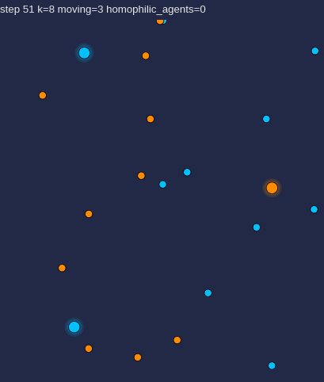
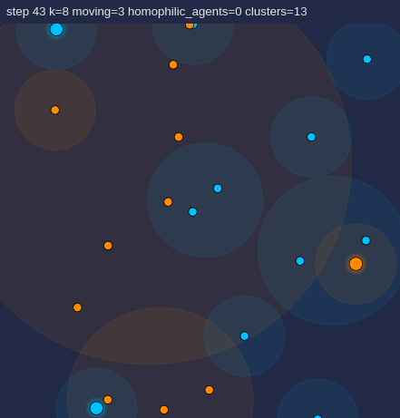
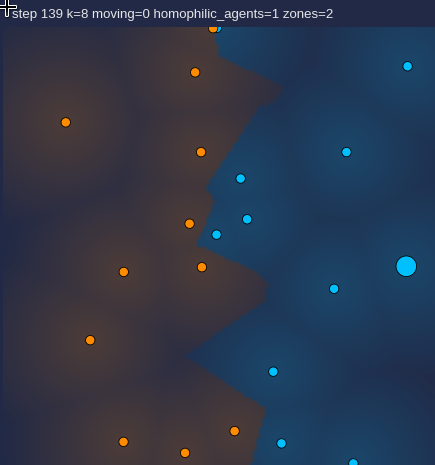
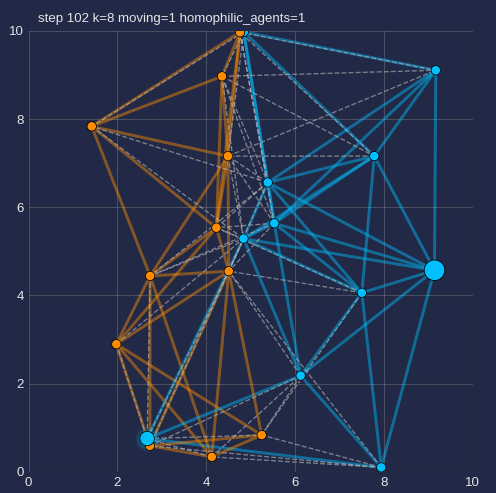
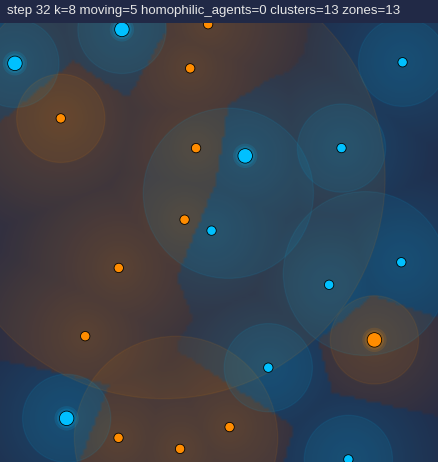
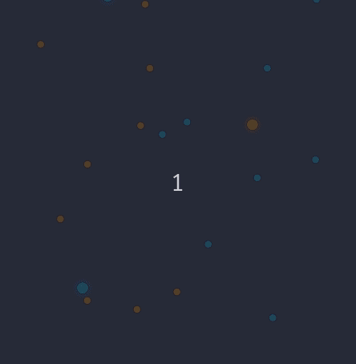

# The Quiet that divides

**Like a town split by a rumor, we circle until the sound tells us who to stand beside until without knowing why, we find ourselves living in two different graves.**


<br>Whether 'tis nobler in the mind to suffer the slings and arrows of outrageous fortune. Or to take arms against a sea of troubles… *(W. Shakespeare, Hamlet - Act III, Scene I).*

## Genesis

> This repository contains a Python agent-based demo reproducing the experiment described in "[Understanding how a group of people splits](https://news.cnrs.fr/articles/understanding-how-a-group-of-people-splits)" where agents are assigned hidden colors. Each agent’s sensor beeps when a majority of its k-nearest-neighbors are of the opposite color; they are due to move while beeping and stop when silent.

## Table of contents

<details>
<summary>Contents - click to expand</summary>

- [The Quiet that divides](#the-quiet-that-divides)
  - [Genesis](#genesis)
  - [Table of contents](#table-of-contents)
  - [Experimental protocol (summary)](#experimental-protocol-summary)
  - [Setup](#setup)
  - [What the visualization shows](#what-the-visualization-shows)
    - [Available modes](#available-modes)
  - [Parameters](#parameters)
  - [Data collection suggestions](#data-collection-suggestions)
  - [Philosophical insights](#philosophical-insights)
    - [What people see nearby extrapolates to segregation](#what-people-see-nearby-extrapolates-to-segregation)
    - [Engineered conformity](#engineered-conformity)
    - [When the river widens: the paradox of choice](#when-the-river-widens-the-paradox-of-choice)
    - [Moral and design implications on building fair social systems](#moral-and-design-implications-on-building-fair-social-systems)
    - [Partial conclusion](#partial-conclusion)
      - [super curious to try these intuitions, drop your tips and be my guide! :)](#super-curious-to-try-these-intuitions-drop-your-tips-and-be-my-guide-)
  - [Reproducibility \& improvements](#reproducibility--improvements)
  - [Limitations](#limitations)
  - [References](#references)
  - [License](#license)

</details>

## Experimental protocol (summary)

If you're curious about the experiment:

- **Participants:** N volunteers (22 in the paper's experiment).

- **Equipment:** one wearable position tracker with a beeping device per participant and a central computer that computes k‑nearest neighbors and transmits beep signals to devices.

- **Procedure:**
  1. Assign a hidden color (orange/blue) to each participant.
  2. Fit each participant with the tracker; make sure they cannot know their own or other's color.
  3. Instruct participants to walk freely in the space and to stop when their device is silent; resume walking if it beeps again.
  4. Run the trial until all devices are silent or a maximum time is reached.
  5. Repeat trials with different k values and record data.
  6. Debrief participants after each session (reveal hidden assignments and purpose).

>**Ethics & safety advices:** Obtain informed consent, prohibit physical contact or crowding, limit trial duration, provide breaks, monitor for distress, and perform a full debrief.

## Setup

**Requirements:** Python 3.12+, Numpy, Matplotlib, Scipy.

After downloading or cloning this repository.

1. Install dependencies:

    ```bash
    pip install -r requirements.txt
    ```

2. Run the demo:

    ```bash
    python segregation_sim.py
    ```

3. Change parameters and combine them (examples):

    ```bash
    python segregation_sim.py --N 22 --k 3
    python segregation_sim.py --N 50 --k 7 --area 12
    ```

- Example of a larger run with enabled visualizations and larger simulation:

    ```bash
    python segregation_sim.py \
      --N 200 --k 7 --area 30.0 --steps 2000 \
      --raster-zones --zones-res 90 --zones-alpha 0.2 \
      --cluster-circles --cluster-dist 1.0 --cluster-alpha 0.12
    ```

- You can also use a headless mode (no visuals):

    ```bash
    python segregation_sim.py --N 200 --k 7 --cluster-circles --raster-zones --headless
    ```

   - Output displayed in terminal will display like this:

    ```bash
    Finished steps=95 | homophilic_agents=65 | clusters=2 | zones=4
    ```

    See more about the available [parameters](#parameters) below.

## What the visualization shows

    • Each dot = one agent.
    • color = hidden assignment (orange/blue).
    • Larger hollow dot = currently moving (device is beeping).
    • Smaller dot = stopped (device silent).
    • Very large dot is homophilic (connected to same color peers).
    • Title shows current step, k value, number of moving agents and if activated in detail/influence mode values (homophilic_agents, clusters and main zones).

Simulation ends when no agent is moving or when max steps is reached.

### Available modes

1. "Zen" mode (dots only)



2. Cluster mode



3. Zone mode



4. Detail mode (displays connections between dots)



*Various modes can be combined together:*


<br>cluster + zone mode

> [!WARNING]
> Some combinations affect readability and animation performance.

## Parameters

| Parameter | Meaning | Suggested values / notes |
|---|---:|---|
| **N** | Number of agents | 22 (paper); test with >200 for robustness |
| **frac_orange** | Fraction of agents initialized as the orange state | 0.0–1.0 (default 0.5) |
| **k** | Number of nearest neighbors used by the sensor (agent beeps if a majority of considered neighbors are opposite color). For k=3, the device beeps if two or three agents among the closest three are from the opposite colour; for k=5, this ratio rises to at least three of the five closest. | Sweep: 1, 3, 5, 7, 9 |
| **step_size** | Movement step length when an agent is moving | 0.1–0.5 (affects mixing speed) |
| **random_turn** | Angular noise (std. dev.) applied to heading each step | 0.2–1.0 (higher → more diffusive motion) |
| **area_size** | Side length of the square arena | 10.0 (default); scale with N to keep density |
| **max_steps** | Maximum number of iterations | 400 (default) |
| **seed** | RNG seed for reproducibility | Integer (e.g., 1) |
| **stop_when_silent** | Stop simulation early when no agents are moving | True / False |
| **raster_zones** | Enable rasterized influence overlay (nearest-agent color field) | True / False |
| **raster_zones_res** | Influence raster resolution (pixels per side) — lower → faster | 100–400 (default 150) |
| **zones_alpha_scale** | Max alpha (opacity) for the overlay (0..1) | 0.0–1.0 (default 0.20) |
| **cluster_circles** | Draw merged same-color cluster influence circles (independent of detail mode) | True / False |
| **cluster_dist** | Distance threshold for forming same‑color clusters (influence circles) | ~0.5–1.5 (default 1.0) |
| **cluster_circle_alpha** | Alpha (opacity) for influence circles (0..1) | 0.0–0.5 (default 0.08–0.12) |
| **detail_mode** | Toggle neighbor-line visualization and grid | True / False |

## Data collection suggestions

- **Trials per k:** run many trials per k (≥ 20) for statistics (with different seed values!).  
- **Recorded metrics:** final number of clusters, convergence time, cluster sizes (per trial).  
- **Analysis:** plot mean ± variance of number of groups vs k.
- Expected pattern:
    - small k → many small subgroups.
    - around k ≈ 7 → robust separation into two large zones.
    - beyond that → little change.

## Philosophical insights

•*The night sky is made of many different stars*•

### What people see nearby extrapolates to segregation

*The limited, local information you use to evaluate your surroundings (neighborhood-level instead of a larger level) produce fragmented micro-communities and a moderate increase in information can drive global phase separation.*

[Thomas Schelling](https://en.wikipedia.org/wiki/Schelling's_model_of_segregation) showed in 1971 with simple agent-based simulations that **mild local preferences** (agents needing *only* a small fraction of similar neighbors) produce large-scale residential segregation.
Imagine a neighborhood where each house has an occupant of one of two types (say orange or blue). Each occupant wants at least *a small fraction* of their neighbors to be the same type, not all, but a fraction that do not seem excessive, say at least 30% the same. If an occupant is unhappy (too few same-type neighbors) he moves to an empty house where the preference is satisfied.
Well, Schelling ran simple simulations of many such moves. Even though each occupant is fine with mixed streets, and has no desire for complete separation, the repeated local moves produced large, widely segregated patches: whole neighborhoods became mostly orange or mostly blue.

> [!TIP]
> Expand your worldview with ["The Pruitt-Igoe Myth"](https://en.wikipedia.org/wiki/The_Pruitt-Igoe_Myth) documentary by Chad Freidrichs and ["The Warmth of Other Suns"](https://en.wikipedia.org/wiki/The_Warmth_of_Other_Suns) novel by Isabel Wilkerson.

---

### Engineered conformity

*Large-scale social patterns like segregation can be engineered by altering informational rules rather than changing individual's preferences.*

In the [Asch conformity experiments](https://en.wikipedia.org/wiki/Asch_conformity_experiments) developed in the 1950s, individual participants changed their stated judgments about line lengths to match a **unanimous** but incorrect **group answer** due to the hidden social feedback of peer responses.

Participants judged which of three comparison lines matched a standard line. Confederates in the group all gave the same wrong answer (six actors out of seven said line B is the match though the answer was obviously A). Among the real participants that heard the unanimous wrong answer, many went along and gave that wrong answer too. Unanimous, confident hearing of others makes a person doubt their own perception and infer the group knows something they don't. Most participants will then fit in and avoid embarrassment, creating situations where they publicly conform while privately disagree.

This happens because the participant use other's responses as social information. **A single dissenter** dramatically reduces conformity.

> [!TIP]
> Edutain yourself with a theatre play, ["Twelve Angry Men"](https://en.wikipedia.org/wiki/Twelve_Angry_Men_(play)) by Reginald Rose, and a movie, ["Die Welle"](https://en.wikipedia.org/wiki/The_Wave_(2008_film)) by Dennis Gansel.

---

### When the river widens: the paradox of choice

*People have limited attention and processing ability. More options increase fear of mistakes, and make comparing alternatives harder, so decision quality or satisfaction decreases.*

According to [Herbert Simon](https://www.oxfordreference.com/display/10.1093/acref/9780191843730.001.0001/q-oro-ed5-00019845), you can only focus on so much information and will settle for "good enough" when overwhelmed.
Furthermore, empirical studies led by [Barry Schwartz](https://en.wikipedia.org/wiki/The_Paradox_of_Choice) highlight that beyond a certain point, more options or more data provides little or negative gains in decision quality.
Why? After an optimal point, too much choice or information, whether more products, extra services options often slows decisions and pushes people to pick simpler assortments, defaults, or a few salient cues. This is due to *raising decision cost*.

That suggests **interventions on information quantity** to prevent overload. This may be more effective at reducing harmful polarization than simply increasing raw information flow. Despite a sharp decline in the cost of information, building robust social systems that accomodate quality over quantity and are founded on a business model centered around economics that actually change what people hear from others (the informational and social feedback), without changing their private preferences would address our stasis.

> [!TIP]
> Easy peasy, that's just a [TEDx Talk](https://www.youtube.com/watch?v=VO6XEQIsCoM) ;-D.

---

### Moral and design implications on building fair social systems

*The experiment implies platform designers can influence social phenomenas by tuning what local information users receive, for better or worse.*

A 2015 [study](https://www.science.org/doi/abs/10.1126/science.aaa1160) by Eytan Bakshy demonstrated how design choices affect information segregation.
Analyses showed algorithmic curation and local engagement signals amplify homophily and limit exposure to diverse viewpoints.

That study used de-identified activity from ~10 million Facebook users.

- **First finding:** people mainly look at news that matches their friend's and their own prior preferences **(homophily)**.

- **Second finding:** the News Feed algorithm reduced exposure to **cross-cutting** (ideologically different) news somewhat, but most of the reduction came from people's own networks and choices.

- **Another finding:** even when cross-cutting content appears, information consumption remains skewed.

Small changes in algorithmic ranking rules or engagement signals can increase or decrease exposure to diverse viewpoints, affecting informational segregation at scale.

If News Feed boosts posts that get early likes from your close friends, you’ll see more content similar to what your circle already prefers. That strengthens homogenous clusters and reduces chance encounters with diverging views. **Boosting diverse sources** would increase cross-cutting exposure.

> [!TIP]
> Another documentary-night? Watch ["The Social Dilemma"](https://en.wikipedia.org/wiki/The_Social_Dilemma) by Jeff Orlowski.

---

### Partial conclusion

*Rien ne se perd, rien ne se crée, tout se transforme.* (A. Lavoisier)

Since individuals may **unknowingly** be steered into segregation dynamics. Deployment of systems that alter information flows should include explainability and informed consent by design. Robust options for reverting and mitigating unwanted social effects on global scale are *sine qua none* conditions for their subsistence.

> [!WARNING]
> The [Cambridge Analytica](https://en.wikipedia.org/wiki/Cambridge_Analytica) (2014-2018) scandal about behavioral-targeting applied to political campaigns. The firm’s opaque use of microtargeted psychographic data to influence voters produced emergent shifts in political behavior without user's awareness highlighting ethical concerns about steering populations via shady informational manipulations. A good [documentary](https://en.wikipedia.org/wiki/The_Great_Hack) about it and [a movie](https://en.wikipedia.org/wiki/Brexit:_The_Uncivil_War) based on these events.

#### super curious to try these intuitions, drop your tips and be my guide! :)

*Metaphors* ft. [pareidolia](https://en.wikipedia.org/wiki/Pareidolia).

1) The *12th man* in action.


<br>**The a-homophilic factor.** *A lone steppenwolf wandering into unchartered territory initiates a new dynamic among the oppposites. This domino kinda fascinates me.*

1) Homophilic agents


<br>**ὁμόςφιλία.** *What's this bigger dot all about?*

## Reproducibility & improvements

To collect reproducible statistics, extend the script to log trials to CSV and run batch experiments varying k and N.

• **Possible extensions:** alternative movement rules (e.g., agents move toward same-color neighbors), noisy sensors (probabilistic beeps), dynamic k (time-varying information), or spatially heterogeneous environments.

## Limitations

- Current model is **simplistic**.  Mapping spatial segregation to opinion polarization is metaphorical. Many social, structural, and psychological factors are absent.

- The experiment shows **plausibility** of information-driven segregation, not its inevitability in real societies.

- Participants don’t know rules; behavior may change with awareness ([Hawthorne effect](https://en.wikipedia.org/wiki/Hawthorne_effect)) or repeated exposure.

- Stopping when silent is an imposed rule that may not map to real social movement or opinion change.

- Real humans use richer signals (speech, gaze, context) while binary beep coarse-grains many cues.

- Nearest is a simple proxy for "information amount".

## References

- [CNRS Le Journal](https://news.cnrs.fr/articles/understanding-how-a-group-of-people-splits)
| [FR](https://lejournal.cnrs.fr/articles/une-experience-pour-comprendre-comment-se-divise-un-groupe-de-personnes)

- Jayles, B., Escobedo, R., Pasqua, R., Zanon, Ch., Blanchet, A., Roy, M., Trédan, G., Théraulaz, G., & Sire, C. (2020). Collective information processing in human phase separation. [Phil. Trans. R. Soc. B, 375:20190801.](https://royalsocietypublishing.org/doi/full/10.1098/rstb.2019.0801)

## License

This project is released into the public domain under the [CC0 license](https://creativecommons.org/public-domain/cc0/). See the [LICENSE](/LICENSE) file for details.

Cite the references above when publishing results derived from the demo.

> mistigri \mis.ti.ɡʁi\ est un nom masculin vieilli qui désigne un chat, un valet de trèfle, ou une mauvaise carte perdante (ou le jeu du pouilleux) et, par extension, une responsabilité difficile que l'on doit assurer sans aide.

🃟
